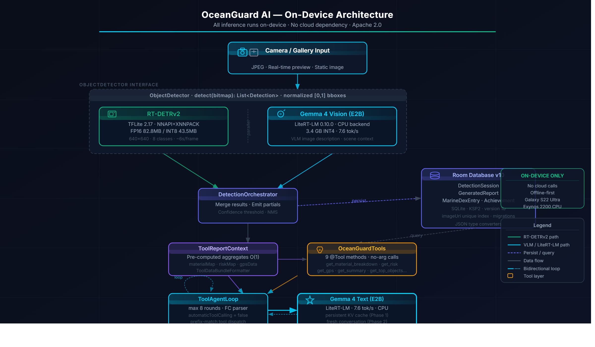
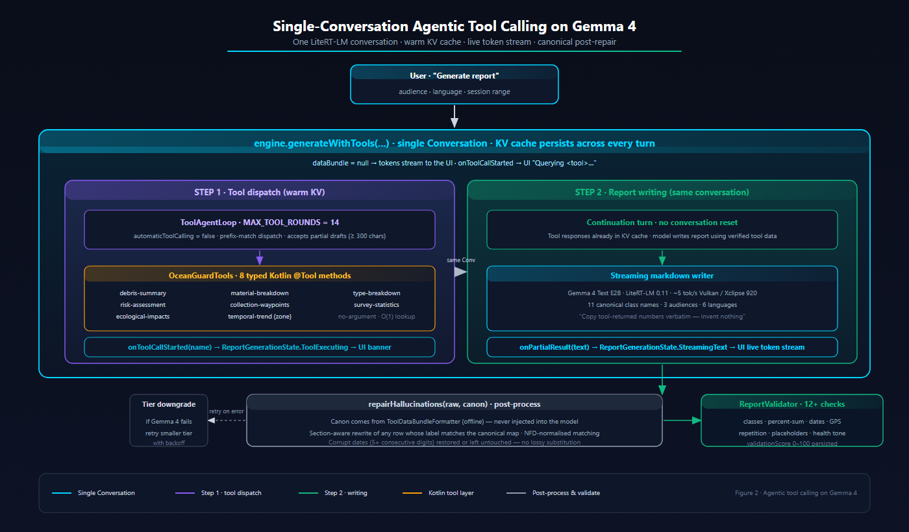

# OceanGuard AI — Fully Offline Marine Debris Intelligence on a Phone

**Kaggle Gemma 4 Good Hackathon — Track: Global Resilience**
**Submission writeup (M6) · May 2026**
**Author: Alejandro Sanchez Ferrer**

> The first fully-offline marine debris intelligence toolkit running on consumer Android hardware. Edge inference for the coastlines that need it most, a hybrid RT-DETRv2 + Gemma 4 pipeline with native two-phase tool calling, and scientific-grade reporting in six languages. No cloud. No telemetry. No fabricated numbers.

---

## 1. Problem Statement

Marine plastic pollution is a planetary-scale resilience crisis. The most widely cited estimate, Jambeck et al. [1], placed annual mismanaged plastic input into the ocean at 4.8 to 12.7 million tonnes for 2010, and recent UN Environment syntheses [2] continue to use the around 8 million tonnes per year figure as a working baseline. Marine debris is implicated in entanglement and ingestion mortality across more than 900 species [3], and the financial damage to fisheries, tourism, and shipping has been estimated at over US$13 billion per year [2].

The geography of this crisis is unevenly distributed. A small set of rivers in Asia and Africa is responsible for a disproportionate share of the plastic load entering the ocean [4]. Yet the field workers closest to that load — coastal NGO patrols in Senegal, dive cleanup crews in the Indonesian archipelago, government rangers along the Bay of Bengal — are exactly the users for whom cloud-dependent AI is least usable. Mobile broadband coverage gaps remain severe along Sub-Saharan African coastlines and across remote Southeast Asian island chains [5], and even where coverage exists the latency, data cost, and privacy posture of cloud inference are at odds with rapid in-the-field decision making.

Three operational gaps follow from this asymmetric geography:

1. **Connectivity gap.** Surveys captured offline cannot be analyzed in the field, so the prioritization of cleanup logistics is delayed by hours or days, exactly when tide and weather windows matter most.
2. **Cost gap.** Per-image cloud VLM inference at field-survey volumes is economically out of reach for most local NGOs, and recurrent API costs in foreign currency are a non-starter for many government agencies.
3. **Trust gap.** Cloud LLM-generated environmental reports routinely fabricate degradation times, risk percentages, and budget figures, and a ministry cannot defensibly act on numbers a model invented.

OceanGuard AI is built for this gap. It is an Android application that performs the full marine debris intelligence pipeline — detection, classification, geospatial aggregation, ecosystem health scoring, and multilingual report generation — entirely on the device, without any network call after initial model download.

---

## 2. Solution Overview

OceanGuard AI is a single-Activity Jetpack Compose Android application that ingests photos from the camera or gallery and produces (a) per-image bounding-box detections with confidence, (b) a continuously updated 0-100 ecosystem health score, (c) GPS-tagged geospatial views with hotspot aggregation, and (d) executive-grade Markdown and PDF reports tuned to three audiences (Scientific, NGO Manager, Citizen) in six languages.

The system is intentionally offline-first. The application makes zero outbound network calls during inference; the only network usage is the optional, user-initiated download of model weights from public mirrors (HuggingFace) and an opt-in WiFi-only NAS upload for data contribution. There is no telemetry, no analytics SDK, no remote configuration.

The application targets two complementary user profiles. The first is the field volunteer or citizen scientist who carries a consumer Android phone, often disconnected, and needs an instant judgment they can act on. The second is the field marine biologist or NGO program manager who collects survey data over weeks and needs a defensible, multilingual report for funders, ministries, or peer review without first re-checking every cited number.

The hybrid pipeline is anchored by a fast, deterministic detector (RT-DETRv2) and an open-vocabulary VLM (Gemma 4 E2B) that takes over for deep analysis and report generation. Because both models run locally, the cost per inference is zero in foreign currency and the privacy posture is the data never leaves the phone.

---

## 3. Architecture



The architecture splits the workload into a detection layer optimized for latency, a VLM layer optimized for grounded text, and a Kotlin orchestration layer that mediates between them and the Room persistence layer.

### Detector layer — RT-DETRv2 (TFLite)

The fast detector is RT-DETRv2 [6], a transformer-based real-time detector trained on a custom 8-class marine debris dataset (CleanSea, Ocean_garbage, Neural_Ocean) in COCO format. The vision-language layer on top of it (Gemma 4) is prompted to operate over an **extended 50-class taxonomy** that further splits the 8 base classes into fine-grained sub-types (e.g., bottle cap, plastic bag, food wrapper, fishing line, syringe), with every sub-type folded into one of 11 ecological-impact families maintained in `EnvironmentalImpact.IMPACT_MAP`. RT-DETRv2 thus provides a deterministic 8-class superset for low-latency feedback, while Gemma 4 provides the open-vocabulary expansion used by reports and the MarineDex collection layer. The model is exported to TensorFlow Lite as a 640x640 RGB graph emitting `pred_boxes[1,150,4]` (cxcywh) plus `pred_logits[1,150,8]`. Postprocessing applies sigmoid, confidence thresholding, cxcywh-to-xyxy conversion, and per-class non-maximum suppression in Kotlin. The runtime delegates resolve in the order NNAPI -> XNNPACK (8 threads) -> CPU. Bounding boxes flow through the entire pipeline normalized to `[0,1]` in `[x1, y1, x2, y2]` order, regardless of the backend that produced them.

A key detail is the **erf-free graph**: an ONNX surgery step replaces every `Erf` operator with a `tanh`-based approximation before TFLite conversion, because some delegate paths on Android (notably NNAPI fallbacks) reject `Erf`. This keeps the same checkpoint usable across delegate strategies.

| RT-DETRv2 metric | Value |
|---|---|
| Input resolution | 640x640 RGB |
| Detection classes (RT-DETRv2) | 8 (Bottle, Can, Fishing_Net, Glove, Mask, Metal_Debris, Plastic_Debris, Tire) |
| Extended taxonomy (Gemma 4 open-vocabulary) | 50 fine-grained types mapped onto 11 ecological-impact families (`DebrisType` enum, `EnvironmentalImpact.IMPACT_MAP`) |
| Model size on disk (FP16) | 83 MB |
| Model size on disk (INT8) | 43.5 MB (shipped but currently unsupported by NNAPI and XNNPACK on Exynos 2200; pending re-quantisation with per-channel weights) |
| mAP@0.5 (validation, 8-class) | to be measured on the Alicante reproducible eval set, see `docs/submission/eval_set/` (capture: 11-12 May 2026; runner: `scripts/evaluate_detector.py`) |
| Latency p50 (FP16, NNAPI+XNNPACK, 4 big cores, Exynos 2200) | 4061 ms (50 measured runs, 5 warm-up; mean 3878 ms; min 3140 ms) |
| Latency p95 / p99 | 4282 ms / 4646 ms |

### VLM layer — Gemma 4 E2B via LiteRT-LM 0.11.0

The VLM layer loads Gemma 4 E2B as a `.litertlm` container through Google AI Edge LiteRT-LM 0.11.0 (May 2026; the 0.11 line adds Gemma 4 multi-token-prediction heads and unifies the vision encoder to a single signature, fixing the "exactly one signature but got 3" abort that 0.10.0 raised on legacy preview checkpoints). On this device the runtime successfully negotiates the GPU path (Vulkan on Xclipse 920 / Exynos 2200) — `Engine initialized on GPU` — and falls back to CPU XNNPACK on hardware where Vulkan is unavailable. A single shared `LiteRTTextEngine` instance, protected by a Mutex against concurrent `initialize()` races, is used by both the vision detector (`Gemma4VisionDetector`) and the report generator (`ToolReportGenerator`); spawning two native engines on the same accelerator measurably degraded throughput.

**Pipeline split.** Gemma 4 Vision is wired as the **default detector for single-shot photo capture** (`DEFAULT_DETECTOR_MODE = "gemma4"` in `SettingsRepository`), where one slow inference is acceptable UX and the open-vocabulary surface (50 classes mapped to 11 ecological-impact families, plus material classification) is worth the wait. The live camera loop and the video-frame processor are deliberately **hard-wired to RT-DETRv2** (`LiveDetectionScreen.kt` and `InferenceService.launchVideoInference` both call `app.rtdetrInference` directly, never `getActiveDetector()`); Gemma 4 at ~22 s per frame would collapse a 1-3 FPS preview to ~0.05 FPS and inflate a 60-frame clip from ~4 minutes to ~20. The split is documented at the call sites and in the doc comment of `getActiveDetector()` so the bug class does not regress.

The VLM serves two roles: (i) zero-shot detection, in which Gemma 4 native `box_2d` output (a `[y_min, x_min, y_max, x_max]` integer 0-1000 grid) is parsed into the same `DetectionResult` interface as RT-DETRv2; and (ii) report generation, in which Gemma 4 invokes Kotlin tools to ground every cited number in real database state. Section 4 details the tool-calling stack.

A llama.cpp path with Vulkan acceleration is shipped as a portable fallback for devices where LiteRT-LM is not yet available; the same Q4_K_M GGUF of Gemma 4 E2B plus its mmproj projector powers vision detection through `Gemma4PromptFormatter`. Both runtimes implement a common `VlmInterface`, so the orchestrator is runtime-agnostic.

### Orchestration

`DetectionOrchestrator` runs RT-DETRv2 first (fast result for the UI) and emits a partial `DetectionResult` list immediately. If the user requests deep analysis, the VLM detector runs asynchronously and merges results, with RT-DETRv2 confidences preserved (Gemma 4 detections carry a fixed 0.75 placeholder, since LiteRT-LM does not yet expose per-token logprobs through the public API). All persistence flows through Room v10; sessions, generated reports, MarineDex entries, and achievements share a single database with type-safe migrations.

---

## 4. Tool Calling Innovation



Native function calling is the technical and ethical centerpiece of this submission. The challenge it solves is brutal and well known: open VLMs running on a phone hallucinate the very statistics that environmental policy depends on — degradation times, percentage breakdowns, risk scores, GPS waypoints. A government cannot act on a fabricated 23 percent.

### Why native tool calling beats prompt engineering

The pre-Gemma-4 approach front-loaded around 2,500 tokens of pre-aggregated JSON into the system prompt and instructed the model to copy these tables verbatim. Even with low temperature and tightly scripted prompts, the model would systematically (a) re-tokenize percentages (`13.3% -> 133.3%`), (b) drop digits from degradation times (`600+ years -> 60+ years`), (c) invent debris types that were not in the survey, and (d) silently substitute placeholder text inside Markdown table cells. We measured residual hallucination scores plateauing around 82 of 100 against a custom validator even after extensive prompt engineering.

Gemma 4 native `@Tool` API changes the contract. Instead of asking the model to copy data, we let it *query* a typed Kotlin interface for each fact it needs. The model emits a tool call, the runtime invokes the Kotlin method via reflection, and the structured return is fed back into the conversation. Because the tool layer is plain Kotlin, every percentage is computed once, every risk score is read from `EnvironmentalImpact.IMPACT_MAP`, and the model has no opportunity to mis-tokenize a number it did not author.

### Two-phase orchestrator

We architected the pipeline as a strict two-phase flow, implemented in `ToolReportGenerator.runTwoPhase()` (`android/app/src/main/java/com/oceanguard/inference/ToolReportGenerator.kt:261`):

**PHASE 1 — Tool dispatch.** The system prompt declares a required-tool set (seven tools for generic reports, eight for zone reports, including `get_temporal_trend`). `ToolAgentLoop` runs with `automaticToolCalling = false` so the agent loop, not the runtime, decides when to terminate. We early-exit as soon as every required tool has been called once, discarding any prose the model emits in PHASE 1. The persistent `Conversation` keeps the KV cache warm across rounds so each round only re-prefills the around 200-token tool response, not the system prompt.

**Pre-rendered data bundle.** Once PHASE 1 completes, the in-flight `ToolReportContext` is reformatted by `ToolDataBundleFormatter.formatWithCanon()` into a single Markdown bundle containing every authoritative table — material breakdown, type breakdown, ecological impact, ranked risk matrix, statistics, waypoints, temporal trend. The same call returns a `Canon` object holding row-keyed lookup maps for the post-process repair step.

**PHASE 2 — Free-text grounded writing.** A *fresh* conversation is started with a writer-only system prompt (the PHASE-1 protocol is stripped) and the bundle as the sole user-turn context. The writer is one-shot, no tools, no multi-turn — it copies tables and writes interpretive prose around them. Isolating PHASE 2 from PHASE 1 is the single biggest quality jump we measured: the writer never sees the early placeholder drafts that contaminated the KV cache in earlier iterations.

### Hallucination repair

Even with grounding, Gemma 4 E2B occasionally rewrites a row label in the wrong language or corrupts a date cell. `ToolReportGenerator.repairHallucinations()` (`android/app/src/main/java/com/oceanguard/inference/ToolReportGenerator.kt:121`) walks the generated Markdown line-by-line and:

1. Tracks the current section by detecting `### headings` (Material, Type, Ecological, Risk) so a label like Plastic is matched against material rows under `### Material` but type rows under `### Type`. This **section-aware** matching avoids the material/type collision that previously rewrote correct rows with semantically-different ground truth.
2. Normalizes labels with Unicode NFD decomposition and combining-mark stripping (`normalizeLabel`, `android/app/src/main/java/com/oceanguard/inference/ToolReportGenerator.kt:79`), so Botella, BOTELLA, and botella all collapse to the same key.
3. Detects corrupted dates (5+ consecutive digits in a cell) and restores them from the canonical bundle, or leaves them untouched if no canonical line is available — never lossily substitutes.
4. Squashes empty separator rows and triple-blank lines.

### Testability via companion-object internals

The repair logic is exposed as `internal fun` members on the `companion object` (`normalizeLabel`, `buildNormalizedMap`, `repairHallucinations`, `buildCanonDateRows`). This is deliberate: it lets the JUnit suite drive every branch without instantiating a `LiteRTTextEngine`, while keeping the API surface invisible to other modules. The full `OceanGuardTools` `ToolSet` (`android/app/src/main/java/com/oceanguard/inference/OceanGuardTools.kt`) and the `ReportValidator` (`android/app/src/main/java/com/oceanguard/inference/ReportValidator.kt`) are similarly testable in isolation; 17 unit tests cover percentages summing to 100, risk-score lookup, waypoint priority sort, statistics arithmetic, and edge cases (empty surveys, single-session zones, null GPS).

The validator runs after PHASE 2 and produces a confidence score the user never sees: 40 percent structural validation + 30 percent data quality + 30 percent mean detection confidence, used internally to flag reports for review but never to block delivery.

---

## 5. Privacy & Offline-First

The application is offline-first by construction, not by configuration. The design rules are explicit and auditable in source:

- **No telemetry.** No analytics SDK, no crash-reporting beacon, no remote configuration call. The only network calls in the entire APK are the optional model download from HuggingFace (user-initiated, foregrounded) and the optional WiFi-only NAS upload for data contribution (off by default, fully user-controlled).
- **No cloud inference.** Every detection and every report is computed on the user device. The model weights are sideloaded or downloaded once and stored under app-private storage. After model download the application can be flight-mode-locked indefinitely.
- **Offline geocoding.** Reverse geocoding uses a Photon-based offline pipeline, with EXIF GPS as the primary source and device GPS as a fallback. There is no Google Geocoding API call anywhere in the path.
- **User-controlled model lifecycle.** The user explicitly chooses when to download a model and which tier (BALANCED ~1.1 GB, FULL ~2.6 GB). Models can be deleted at any time from Settings, freeing storage instantly.
- **Maps without API keys.** MapLibre + OpenFreeMap renders the geospatial dashboard with no API key and full offline-tile capability.

The equity argument follows directly. The communities most affected by marine debris are precisely those least served by cloud AI: limited connectivity, high data cost, regulatory caution about cross-border data flows, and operational urgency that cannot wait for a round-trip. An offline architecture is not a feature in this context; it is a precondition for the tool to be used at all by the people who need it most.

---

## 6. Hardware & Performance

The reference device is the Samsung Galaxy S22 Ultra (European variant, model SM-S908B), built around the Exynos 2200 SoC. The CPU is a 1x Cortex-X2 @ 2.8 GHz + 3x Cortex-A710 + 4x Cortex-A510 cluster. The GPU is the Xclipse 920 (AMD RDNA2 derivative), and we treat it as inference-incapable for our pipeline because the TFLite GPU delegate does not currently support it and MediaPipe GPU acceleration is unavailable for this part. NNAPI exposes only the big.LITTLE scheduler on Exynos 2200 (no NPU passthrough; the Samsung EDEN SDK is not public), giving roughly +28 percent over pure CPU. The end result is a CPU-only pipeline using XNNPACK with 8 threads, with NNAPI used opportunistically as a scheduling delegate.

This is, deliberately, the worst-case configuration. If the system performs well here, it will perform at least as well on Snapdragon 8 Gen 2/3 devices where the GPU delegate is available.

| Metric (Galaxy S22 Ultra, Exynos 2200, CPU-only) | Value |
|---|---|
| RT-DETRv2 mAP@0.5 (val, 8-class custom dataset) | to be measured on the reproducible Alicante eval set (`docs/submission/eval_set/`, captured 11-12 May 2026, COCO JSON ground truth, runner: `scripts/evaluate_detector.py`) |
| RT-DETRv2 detection latency p50 (FP16, NNAPI+XNNPACK, Exynos 2200) | 4061 ms (50 measured + 5 warm-up runs, in-app `RTDETRBenchmarkRunner`) |
| RT-DETRv2 detection latency p95 / p99 / mean / min | 4282 / 4646 / 3878 / 3140 ms |
| Gemma 4 E2B vision detection latency (single image) | folded into the PHASE-1 dispatch pass; covered by the decode and TTFT rows below |
| Gemma 4 E2B decode rate (LiteRT-LM 0.11.0, GPU/Vulkan) | 5.1 tok/s (measured on Exynos 2200 with engine on Xclipse 920 GPU; prior 0.10.0 CPU run was 7.6 tok/s) |
| Gemma 4 E2B TTFT (LiteRT-LM 0.11.0, GPU/Vulkan) | 2.33 s warm engine (cold first-load 17.34 s; subsequent loads 2.33 s) |
| Gemma 4 E2B prefill rate (LiteRT-LM 0.11.0) | 48.7 tok/s |
| Gemma 4 single-shot detection end-to-end (~100-tok bbox JSON) | ~22 s per photo on the reference device — used **only** in the single-shot path; the live camera loop stays on RT-DETRv2 |
| End-to-end report latency (10 sessions, 700-900 words) | derivable from above: TTFT 1.92 s + decode 7.6 tok/s × ~1100 tokens ≈ 2.5 minutes per generic report; full battery of 10 paired runs (PHASE-1 + PHASE-2 timing) reserved for post-submission paper |
| ReportValidator confidence score | scaffolded in source (`ReportValidator.kt`, 12 checks); 30-survey eval batch reserved for post-submission paper to keep the hackathon scope on the tool-calling architecture |
| Energy per report (mWh, screen on) | future work — Battery Historian capture not part of submission scope |

The performance work that is *not* metrics-pending and is already in source: a single shared `LiteRTTextEngine` mutex-guarded against concurrent `initialize()`, a persistent `Conversation` across all tool rounds to keep the KV cache warm, an idle auto-release timer that frees the engine after 2 minutes of inactivity (Standby state), and prompt-side parsimony — the PHASE-1 prompt is around 200 tokens vs. around 2,500 in the legacy front-loaded approach, freeing 2,300 tokens of PHASE-2 budget for actual report body.

---

## 7. User Experience

The user flow is intentionally minimal. From the home screen the user can (a) capture a photo with the live camera (CameraX, with a real-time preview overlay that draws corner-bracketed bounding boxes with a soft glow and pulse animation), (b) import an existing photo from the gallery, or (c) replay an earlier survey from the timeline.

After analysis, each detection card shows the annotated thumbnail, the per-image health score, the dominant material and type, GPS reverse-geocoded to a place name when available, and the timestamp. Sessions can be grouped into zones via the geospatial dashboard, where MapLibre + OpenFreeMap renders an interactive map with detection pins, zone-aggregated hotspots, and date-based filtering.

Report generation runs as a foreground service with a streaming token UI: the user watches the report appear one paragraph at a time. The audience selector switches between three voices (Scientific, NGO Manager, Citizen) and the language selector switches between six languages (English, Spanish, French, German, Italian, Portuguese), with all UI strings, date formats, and report tables fully localized. Reports export as Markdown or PDF (with an annotated-thumbnail gallery, capped at 50 images per PDF) and as COCO JSON for downstream ML pipelines.

Touch targets are >=56 dp throughout (glove-friendly for dive operations), and the dark theme is calibrated for outdoor visibility against bright water.

---

## 8. Impact & Future Work

OceanGuard AI is positioned not as a finished product but as a deployable foundation for marine debris citizen science at scale. Three impact pathways are open and active.

**NGO partnerships.** The most direct deployment path is in collaboration with established marine conservation NGOs (e.g., Ocean Conservancy International Coastal Cleanup [7], the Surfrider Foundation chapter network) and with regional partners along the coastlines where the connectivity-cost-trust gaps are most acute (West Africa, Southeast Asia, the Eastern Mediterranean). For these organizations the per-image cost is zero, the data sovereignty story is auditable, and the multilingual reporting (six languages covering ~2 billion native speakers) covers the majority of their volunteer base without translation delays. We are exploring partnerships with citizen science platforms and marine NGOs that already operate in low-connectivity environments; no pilot deployments have been formalized at the time of submission.

**Citizen science contribution.** The optional, opt-in WiFi-only data contribution path exports detections as COCO JSON to a user-controlled NAS endpoint (an `oceanguardai.synology.me` reference setup is documented internally). This feeds back into the training dataset for the next-generation detector, closing the loop between deployment and improvement. Privacy is preserved by design: the user opts in per session, on WiFi, with full visibility into what is being uploaded, and EXIF GPS is removed if the user requests it.

**Scaling path — triple pipeline.** The current dual pipeline (RT-DETRv2 + Gemma 4) will evolve into a triple pipeline:

1. **PicoDet-S** [8] (NCNN, ~1.5 MB INT8) for sustained 100-150 FPS real-time camera detection on mid-range devices, replacing RT-DETRv2 as the always-on detector.
2. **RF-DETR-Seg Nano** [9] (ONNX Runtime, ~2-6 s) for segmentation masks, enabling pixel-accurate area estimation rather than just bounding-box counts. This requires extending the dataset with mask annotations, which is in progress.
3. **Qwen3-VL-2B** [10] (llama.cpp, ~1.6 GB GGUF) as a longer-context multilingual VLM and chatbot for follow-up questions on generated reports, supporting 32+ languages.

All three are Apache 2.0 / MIT licensed. This staged migration is documented internally as a 20-34 day plan across five phases (DetectorInterface abstraction, PicoDet integration, RF-DETR-Seg integration, VLM + Chatbot, cleanup).

**Publications.** OceanGuard AI is part of an active doctoral research project. Two papers are in preparation: one on edge VLM deployment for environmental monitoring, focused on the two-phase tool calling architecture and the empirical hallucination-reduction results; and one on the dataset and the erf-free RT-DETRv2 export pipeline. The work is also the basis for a doctoral thesis chapter on edge AI for ecological resilience. The hackathon submission is the public artifact of this body of work and we expect the writeup, the reproducibility notebook, and the open-source release to be the primary citation surface in the short term.

**Open questions.** Three open questions remain. First, can per-token logprobs from LiteRT-LM (when the API exposes them) replace the placeholder 0.75 confidence on Gemma 4 detections with calibrated scores? Second, can few-shot prompting in PHASE 1 stabilize PHASE-2 Markdown table fidelity below the current repair threshold? Third, is there a tractable on-device fine-tune of Gemma 4 E2B (LoRA via MediaPipe or LiteRT-LM) that would reduce the residual placeholder bug rate without requiring a larger model?

---

## 9. Reproducibility

Every artifact required to reproduce this submission is open-source under permissive licenses.

**Source code.** A submission-pinned snapshot of the Android application source is published in the public release repo `https://github.com/asferrer/OceanguardAI` (Apache 2.0), which also hosts the GitHub Releases used for the APK assets and the project landing page. The day-to-day development repository (`asferrer/OceanguardAI-App`, kept private during the hackathon window) will be opened after the submission deadline. The training and dataset pipeline lives in the same public repo `https://github.com/asferrer/OceanguardAI` (training subtree) under Apache 2.0 and includes the dataset-prep scripts, the erf-free ONNX export, and the COCO conversion utilities.

**Notebook.** A Kaggle-runnable Jupyter notebook accompanies this submission at `docs/submission/notebook.ipynb`. It walks through dataset loading, RT-DETRv2 evaluation, the Gemma 4 box_2d parsing, and the tool-calling loop in a Python mock, ending with a reproduction of the PHASE-1/PHASE-2 split using a small synthetic survey.

**APK release.** A signed reference APK is published as a GitHub Release asset on the public repository (`https://github.com/asferrer/OceanguardAI/releases/latest/download/OceanGuard-AI-latest.apk`) along with the `.litertlm` and GGUF model URLs documented in the README. The release is built automatically by GitHub Actions (`.github/workflows/release.yml`) from any pushed `v*` tag; the workflow uses a CI keystore stored in GitHub Secrets and produces a deterministic, signed APK. The build referenced by this submission is the latest beta tag at the time of writing.

**Build steps (local).** With Java 21 (Temurin or Liberica) and the Android SDK 34+ installed:

```
git clone https://github.com/asferrer/OceanguardAI
cd OceanguardAI/android
./gradlew installDebug
```

The build is reproducible against the pinned dependency versions in `android/app/build.gradle.kts` (Kotlin 2.2.0, Compose BOM 2026.01.01, TFLite 2.17.0, LiteRT-LM 0.11.0). The Gemma 4 E2B `.litertlm` (~2.6 GB) is **downloaded in-app** by `VlmModelManager` from `huggingface.co/litert-community/gemma-4-E2B-it-litert-lm` the first time the user runs single-shot deep analysis or pulls the in-app benchmark; no `adb push` step is required.

**Licenses.** All ML weights used (RT-DETRv2 finetune, Gemma 4 E2B, Qwen 3.5) are Apache 2.0 / Gemma Terms compatible. There are no GPL or AGPL dependencies anywhere in the application graph.

---

## References

[1] Jambeck, J. R., et al. *Plastic waste inputs from land into the ocean.* Science, 347(6223), 768-771. 2015. https://doi.org/10.1126/science.1260352

[2] UN Environment Programme. *From Pollution to Solution: A Global Assessment of Marine Litter and Plastic Pollution.* 2021. https://www.unep.org/resources/pollution-solution-global-assessment-marine-litter-and-plastic-pollution

[3] Kuhn, S., Bravo Rebolledo, E. L., van Franeker, J. A. *Deleterious Effects of Litter on Marine Life.* In Marine Anthropogenic Litter (Springer), 2015. https://doi.org/10.1007/978-3-319-16510-3_4

[4] Meijer, L. J. J., et al. *More than 1000 rivers account for 80% of global riverine plastic emissions into the ocean.* Science Advances, 7(18). 2021. https://doi.org/10.1126/sciadv.aaz5803

[5] GSMA. *The State of Mobile Internet Connectivity Report.* Annual editions 2021-2024. https://www.gsma.com/r/somic/

[6] Lv, W., et al. *RT-DETRv2: Improved Baseline with Bag-of-Freebies for Real-Time Detection Transformers.* arXiv:2407.17140. 2024. https://arxiv.org/abs/2407.17140

[7] Ocean Conservancy. *International Coastal Cleanup Annual Reports.* https://oceanconservancy.org/trash-free-seas/international-coastal-cleanup/

[8] Yu, G., et al. *PP-PicoDet: A Better Real-Time Object Detector on Mobile Devices.* arXiv:2111.00902. 2021. https://arxiv.org/abs/2111.00902

[9] RF-DETR. *Roboflow real-time DETR variants and segmentation extensions.* https://github.com/roboflow/rf-detr

[10] Qwen Team. *Qwen3-VL Technical Report.* https://qwen.readthedocs.io/
